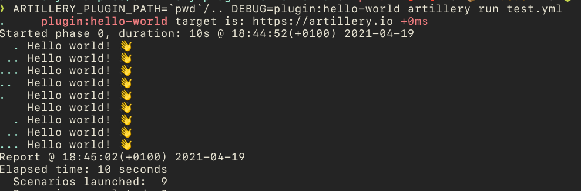
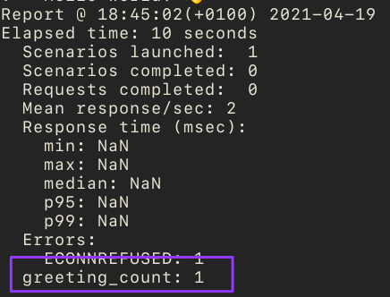

# artillery-hello-world-plugin

This is a "hello world" plugin for Artillery which shows:

- Artillery's plugin interface
- How a barebones plugin is constructed
- How to inspect test script properties in a plugin
- How to attach custom hooks to scenarios in a plugin to do something interesting

## Run the example scenario 👋

By default Artillery will look in Node.js package path for the plugin package (which is expected to have an `artillery-plugin-` prefix, so the package for the `hello-world` plugin is expected to be named `artillery-plugin-hello-world`).

We can add an extra look-up location with `ARTILLERY_PLUGIN_PATH`. This is useful when developing plugins.

From the folder where this README is located, run:

```sh
ARTILLERY_PLUGIN_PATH=`pwd`/.. DEBUG=plugin:hello-world artillery run test.yml
```

And we should see our greeting, debug messages from the plugin, and the counter in Artillery's output:




## Learn more 📖

Check out these plugins for ideas of how to do more things:

- https://github.com/artilleryio/artillery-plugin-publish-metrics
- https://github.com/artilleryio/artillery-plugin-hls
- https://github.com/artilleryio/artillery-plugin-fuzzer
- https://github.com/artilleryio/artillery-plugin-expect

Artillery's extension APIs:

https://artillery.io/docs/guides/guides/extension-apis

Blog post on creating a custom plugin:

https://artillery.io/blog/extend-artillery-by-creating-your-own-plugins

## Write a plugin (and let us know!) ⚡

Artillery's plugin interface + the power of Node.js (there's an npm package for everything!) make it easy to extend Artillery with new functionality.

If you write a new plugin, let us know!

- Github Discussion board: https://github.com/artilleryio/artillery/discussions

💜
