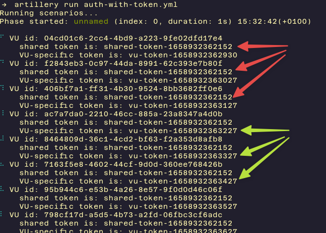

# generating-vu-tokens

A common use-case when testing stateful APIs with Artillery is to generate a token that VUs can use for authentication (e.g. to use with an [OAuth2 Credentials Flow](https://auth0.com/docs/get-started/authentication-and-authorization-flow/client-credentials-flow)). This example shows the basic structure of how that can be done with Artillery:

- We can use a `before` block and a custom JS function to generate a token that will be shared by all VUs in the test (`sharedToken`)
- We can use a `function` step with a custom JS function to generate a token unique to each VU (`vuToken`)
- We can use a value stored in a variable (`sharedToken` or `vuToken`) in a request header for authentication (e.g. as a [Bearer token](https://oauth.net/2/bearer-tokens/#:~:text=Bearer%20Tokens%20are%20the%20predominant,such%20as%20JSON%20Web%20Tokens.))

Run the script with:

```
artillery run auth-with-token.yml
```

The output will look similar to the screenshot below. The value of `sharedToken` generated in the `before` block will be the same for every VU, whereas the value of VU-specific token in `vuToken` will differ between VUs.



To turn this into a working test-case for your API, replace the example implementation of one (or both) of the custom JS functions to implement the token generation logic you need, and tweak the way in which those tokens are sent as appropriate for your API.
