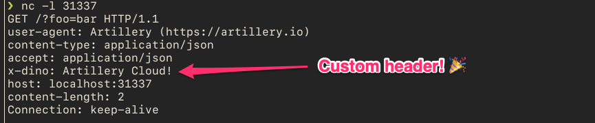

# Set custom HTTP header via custom JS function

This example shows how an HTTP header can be set via a hook function.

---

To test, run `nc` in server mode with:

```shell
nc -l 31337
```

and then run Artillery:

```shell
artillery run set-header.yml
```

You should see custom header `X-Dino` being set:



Tada! 🎉