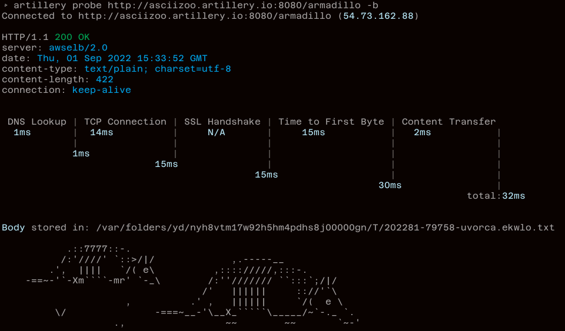

# Separating scenarios into separate files

This example shows how an Artillery test suite can be organized into individual scenario specs, and how those specs can be run one at a time, and all together at the same time.

## Artillery's `--config` flag

This example makes use of the `--config` flag availale in `run` and `aws:run` commands. ([docs](https://www.artillery.io/docs/guides/guides/command-line#run---run-a-test-script))

This flag allows us to extract the `config` section of an Artillery's test script into a separate file and provide it to Artillery when we run a test through the flag.

We can take this one step further, and also extract our scenarios into separate files for a tidier codebase. ✨

## Code layout

Our code in this example is laid out as follows:

```
├── README.md
├── common-config.yml
└── scenarios
    ├── armadillo.yml
    ├── dino.yml
    └── pony.yml
```

- the `common-config.yml` contains configuration for our test
- the `scenarios/` directory contains 3 scenarios

## Service we're testing

We're testing a simple service that returns ASCII pictures of various animals.

For example, to see a picture of an armadillo, send a GET request to http://asciizoo.artillery.io:8080/armadillo:

```sh
skytrace probe http://asciizoo.artillery.io:8080/armadillo -b
```



## Running one scenario

To run one scenario, e.g. the scenario that tests the `/armadillo` endpoint, run:

```sh
artillery run --config common-config.yml scenarios/armadillo.yml
```

## Running multiple scenarios at once

Artillery CLI does not support running multiple scenarios with one command yet, but we can use a short shell script to iterate through the scenario files for us, and run Artillery on each of them in sequence.

On a Mac/Linux system it would look like this:

```sh
for scenarioFile in `ls scenarios/*.yml` ; do
  artillery run --config common-config.yml scenarios/$scenarioFile
done
```

The script looks for files with the `yml` extension under `scenarios/` and runs Artillery with each of those one after another.
